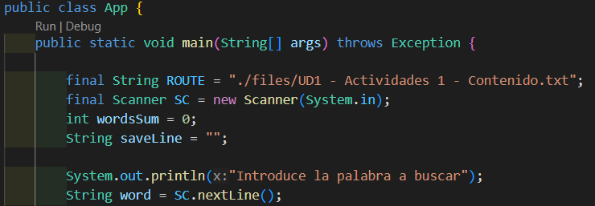
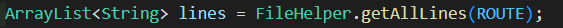
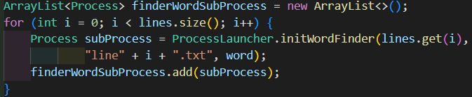
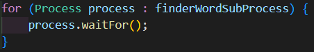
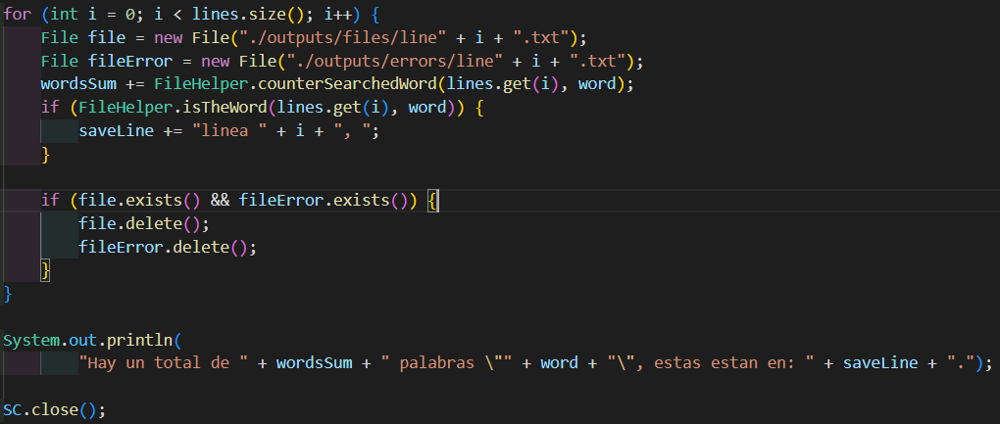
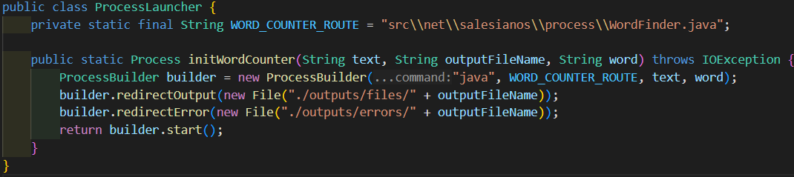
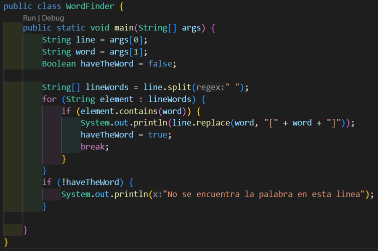
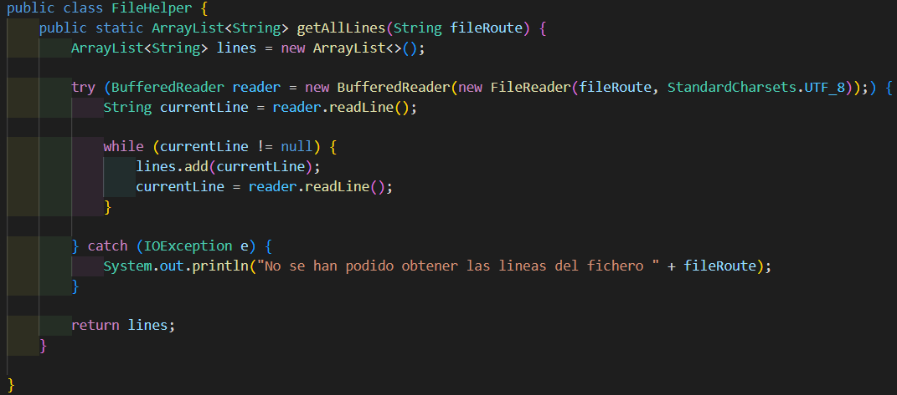
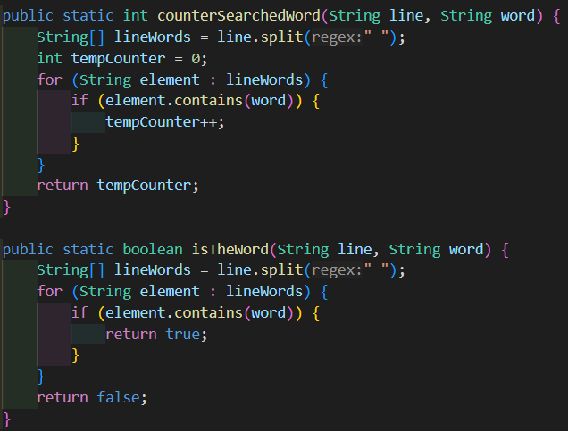

# Guía usuario

# Clase App
La clase App es responsable de recibir una palabra del usuario, leer las líneas de un archivo de texto y lanzar subprocesos para contar la cantidad de veces que la palabra aparece en cada línea. Los subprocesos se ejecutan de manera concurrente y el programa espera a que todos terminen antes de finalizar.

Se declara como constante tanto la ruta en la que se van a buscar las palabras, como el escaner que usaremos para solicitar la palabra a buscar.

Se crea una lista dinámica de String donde se almacenaran todas las lineas de texto del fichero en que se buscan las palabras.

Se crea una nueva lista dinámica, de procesos esta vez, se iterará el mismo número de veces que lineas tiene el fichero a leer, y se llamará a nuestra clase ProcessLauncher para levantar un proceso WordCounter y se guarda esos procesos en la lista.

Se itera sobre la lista de procesos y se espera por la finalización de cada uno.

Se itera sobre el número de lineas y se crean una serie de ficheros "file" y "fileError" a los que se redirigirá al salida en caso de exito o fracaso. La variable wordSum, irá guardando el número de veces que aparece la palabra por linea. En caso de que se encuentre la palabra, se almacenará en la varible saveLine un texto que indique la linea en la que aparece la palabra. Se verificará si existen los ficheros de salida, y en caso afirmativo, se borrarán. Por último, se mostrará por consola un mensaje indicando el número de veces que aparece la palabra y se cerrará el escaner.

# Clase ProcessLauncher

Se declara un atributo privado que será la ruta hacia nuestra clase WordFinder y se crea un método estático que recibirá los parametros necesarios para ejecutar dicha clase. A continuación, se especificará el fichero de salida para un caso de error o de éxito. Este método retornará el levantamiento del proceso.

# Clase Wordfinder

La clase WordFinder declara los atributos line y word como los argumentos 0 y 1 (line corresponde a la de la lista dinámica de la clase App y word corresponde a la palabra que se busca). Se crea una lista de tipo String que corresponde a las palabras que hay en esa linea. Se itera sobre esta lista y en caso de encontrar la palabra, esta es reemplazada por "[palabra]" y se establece como verdadero al variable haveTheWord. En caso de que no se encontrara se escribirá un mensaje indicándolo.

# Clase FileHelper

La clase File Helper crea una lista dinámica de líneas y creará un buffer de lectura de datos, se almacenará la primera linea en la variable currentLine, se crea un bucle while donde, en caso de que la variable sea distinta de nulo, se almacenará dicha linea en la lista lines, se leerá la siguiente linea y se repetirá el proceso hasta que la linea sea nula (este vacía). El buffer se cierra automáticamente ya que se abre en el bloque try. En caso de no poder acceder al fichero se maneja esa excepción y se mostrará un mensaje indicándolo.

Se crea un método counterSearchedWord que recibirá como parametro una linea del fichero y la palabra a buscar. Se creará una lista de tipo string que guarde todas las palabras de la linea pasada como argumento, se crea una variable temporal tempCounter para llevar la cuenta de veces que se encuentra la palabra. Se itera sobre la lista de palabras y en caso de encontrar la palabra buscada, se sumará uno a la variable temporal, que a su vez será devuelta por el método.

El método isTheWord funciona similar a counterSearchedWord solo que este no contará el número de veces que aparece la palabra, en su lugar, devolverá un Boolean en función de si encuentra la palabra o no.
